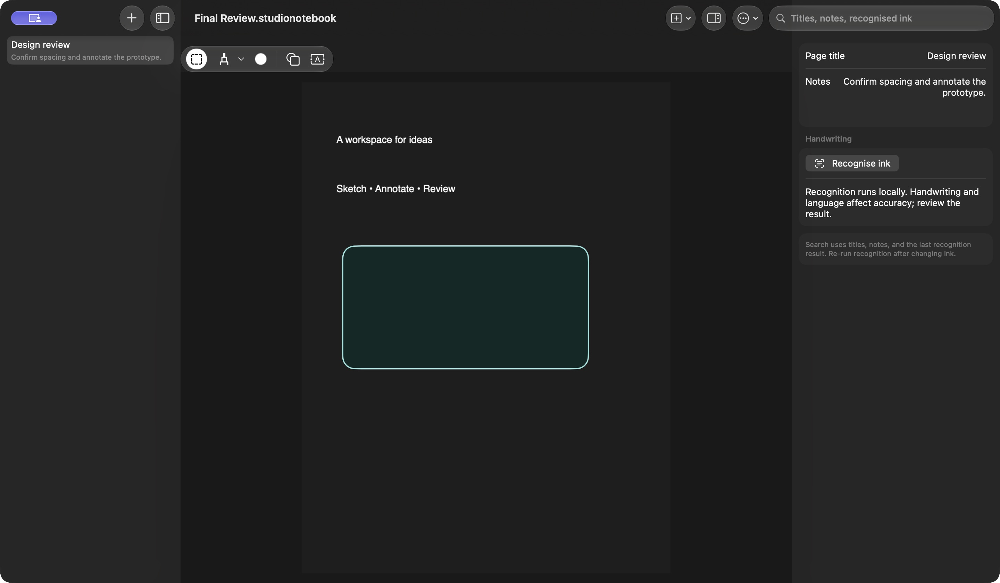
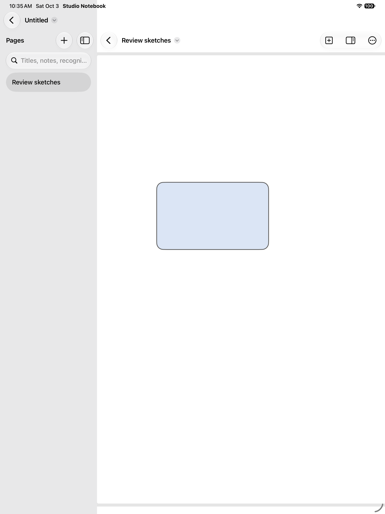

# Studio Notebook

Editable sketch notebooks for iPad and Mac, built with PaperKit, PencilKit, and SwiftUI's document APIs.

## Preview

Mac workspace with a saved notebook and page inspector:



iPad creation and shape-editing workflow:



## Use it

Create a notebook, add pages, then draw or insert text, shapes, and images. Page details holds the title, notes, and recognised handwriting. Search finds titles, notes, and the last recognition result. Changes participate in document autosave and Undo.

Export a notebook copy to keep its editable pages, or export the canvas pages as a PDF. Choose the destination in the system save interface; the app does not expose its entire Documents folder through Finder/USB sharing. Reopen an exported `.studionotebook` file through the document browser or File > Open on Mac. PDF exports contain canvas content; inspector notes and transcripts stay in the editable notebook.

## Run

Requires Xcode 27 and iPadOS 27 or macOS 27. Open `Studio Notebook.xcodeproj` and select **Studio Notebook**. Choose an iPad or Mac destination. A physical iPad build requires your own signing team. Bundle ID: `com.dd.studionotebook`.

```sh
swift test
swift test -c release
bash Scripts/test-ui.sh
```

## Engineering

- Swift 6 complete concurrency with main-actor document state, value snapshots, and background rendering.
- PaperKit canvas bridges use native drawing tools and guard delegate feedback loops.
- Document edits register Undo so the document framework observes mutations and autosaves them.
- A versioned format validates page counts, unique IDs, text lengths, and encoded size before replacing content. Maximum 100 pages and 40 MB per notebook.
- Image imports are limited to 20 MB and 50 megapixels, then downsampled to 2,200 pixels. Original external files are not modified.
- Handwriting recognition runs locally and rejects stale results after the canvas changes. Review its output; accuracy depends on handwriting and language. Recognition does not continuously index changing ink.
- Export and import tasks cancel when the editing view closes.

The repository includes original icons, core format and real PaperMarkup/PDF round-trip tests, and a native iPad creation/edit/export workflow. It has no backend, account, analytics, or external model service.

See [verification](Docs/Verification.md), [privacy](PRIVACY.md), and [contributing](CONTRIBUTING.md). MIT licensed.
